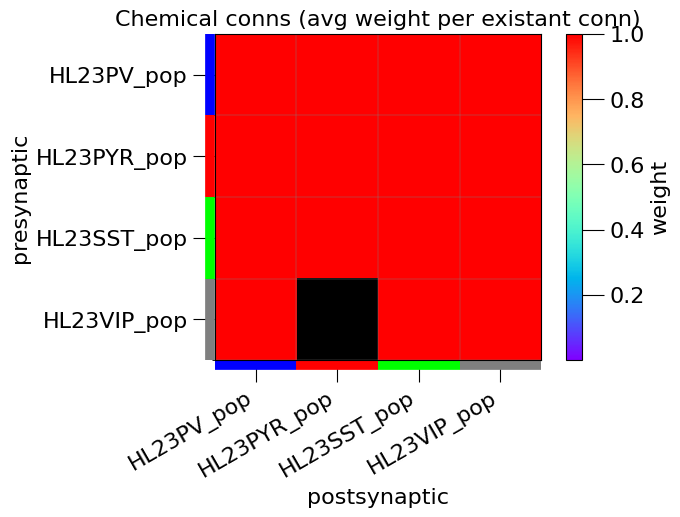
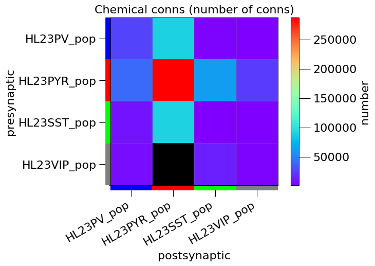
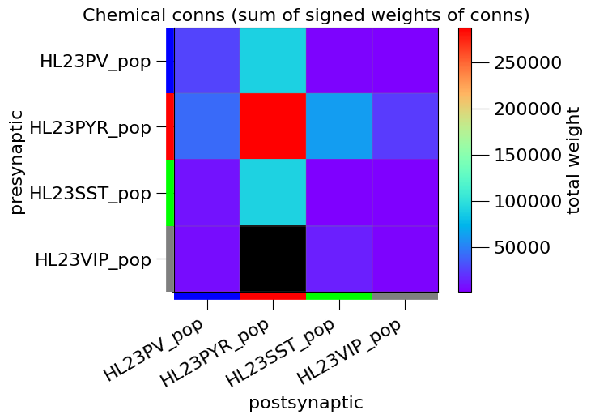
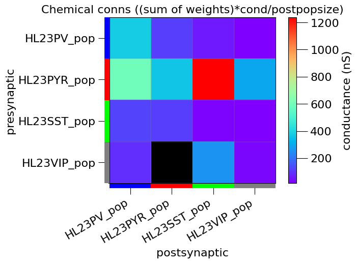
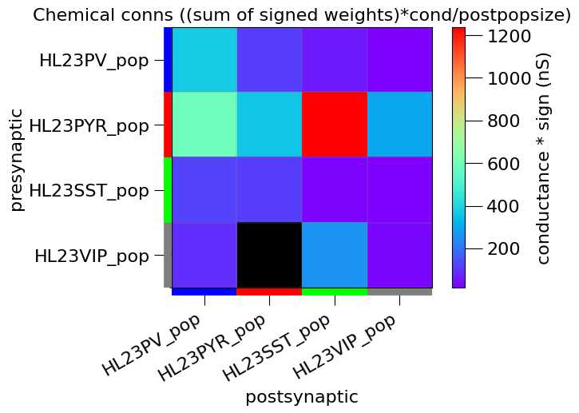

## Analysis of NeuroML network: HL23Net_1.0.net.nml

```
*******************************************************
* NeuroMLDocument: HL23Network
*
*  Network: HL23Network (temperature: 34.0 degC)
*
*   1000 cells in 4 populations 
*     Population: HL23PV_pop with 70 components of type HL23PV_sim
*       Locations: [(-65.3901, -116.9935, -946.9911), ...]
*       Properties: color=0 0 1; region=L23; 
*     Population: HL23PYR_pop with 800 components of type HL23PYR_sim
*       Locations: [(-221.2233, 84.1923, -841.4886), ...]
*       Properties: color=1 0 0; region=L23; 
*     Population: HL23SST_pop with 50 components of type HL23SST_sim
*       Locations: [(106.3510, -214.9518, -645.5753), ...]
*       Properties: color=0 1 0; region=L23; 
*     Population: HL23VIP_pop with 80 components of type HL23VIP_sim
*       Locations: [(155.2388, 108.4729, -620.4400), ...]
*       Properties: color=0.5 0.5 0.5; region=L23; 
*
*   657373 connections in 15 projections 
*     Projection: proj_HL23PV_HL23PV from HL23PV_pop to HL23PV_pop, synapse: HL23PV_HL23PV_ProbUDFsyn
*       26175 connections (wd): [(Connection 0: 58 -> 0:1849(0.66739), weight: 1.000000, delay: 0.50000 ms), ...]
*     Projection: proj_HL23PV_HL23PYR from HL23PV_pop to HL23PYR_pop, synapse: HL23PV_HL23PYR_ProbUDFsyn
*       89216 connections (wd): [(Connection 0: 19 -> 0:511(0.75109), weight: 1.000000, delay: 0.50000 ms), ...]
*     Projection: proj_HL23PV_HL23SST from HL23PV_pop to HL23SST_pop, synapse: HL23PV_HL23SST_ProbUDFsyn
*       2896 connections (wd): [(Connection 0: 24 -> 0:1673(0.96233), weight: 1.000000, delay: 0.50000 ms), ...]
*     Projection: proj_HL23PV_HL23VIP from HL23PV_pop to HL23VIP_pop, synapse: HL23PV_HL23VIP_ProbUDFsyn
*       1295 connections (wd): [(Connection 0: 67 -> 0:488(0.94546), weight: 1.000000, delay: 0.50000 ms), ...]
*     Projection: proj_HL23PYR_HL23PV from HL23PYR_pop to HL23PV_pop, synapse: HL23PYR_HL23PV_ProbAMPANMDA
*       41360 connections (wd): [(Connection 0: 668 -> 0:1082(0.66018), weight: 1.000000, delay: 0.50000 ms), ...]
*     Projection: proj_HL23PYR_HL23PYR from HL23PYR_pop to HL23PYR_pop, synapse: HL23PYR_HL23PYR_ProbAMPANMDA
*       287706 connections (wd): [(Connection 0: 536 -> 0:440(0.77943), weight: 1.000000, delay: 0.50000 ms), ...]
*     Projection: proj_HL23PYR_HL23SST from HL23PYR_pop to HL23SST_pop, synapse: HL23PYR_HL23SST_ProbAMPANMDA
*       61952 connections (wd): [(Connection 0: 536 -> 0:402(0.07810), weight: 1.000000, delay: 0.50000 ms), ...]
*     Projection: proj_HL23PYR_HL23VIP from HL23PYR_pop to HL23VIP_pop, synapse: HL23PYR_HL23VIP_ProbAMPANMDA
*       23592 connections (wd): [(Connection 0: 67 -> 0:2921(0.61882), weight: 1.000000, delay: 0.50000 ms), ...]
*     Projection: proj_HL23SST_HL23PV from HL23SST_pop to HL23PV_pop, synapse: HL23SST_HL23PV_ProbUDFsyn
*       8632 connections (wd): [(Connection 0: 32 -> 0:2144(0.11526), weight: 1.000000, delay: 0.50000 ms), ...]
*     Projection: proj_HL23SST_HL23PYR from HL23SST_pop to HL23PYR_pop, synapse: HL23SST_HL23PYR_ProbUDFsyn
*       90708 connections (wd): [(Connection 0: 32 -> 0:5796(0.61404), weight: 1.000000, delay: 0.50000 ms), ...]
*     Projection: proj_HL23SST_HL23SST from HL23SST_pop to HL23SST_pop, synapse: HL23SST_HL23SST_ProbUDFsyn
*       1236 connections (wd): [(Connection 0: 37 -> 0:1794(0.96906), weight: 1.000000, delay: 0.50000 ms), ...]
*     Projection: proj_HL23SST_HL23VIP from HL23SST_pop to HL23VIP_pop, synapse: HL23SST_HL23VIP_ProbUDFsyn
*       1225 connections (wd): [(Connection 0: 12 -> 0:1601(0.48278), weight: 1.000000, delay: 0.50000 ms), ...]
*     Projection: proj_HL23VIP_HL23PV from HL23VIP_pop to HL23PV_pop, synapse: HL23VIP_HL23PV_ProbUDFsyn
*       6248 connections (wd): [(Connection 0: 34 -> 0:405(0.52838), weight: 1.000000, delay: 0.50000 ms), ...]
*     Projection: proj_HL23VIP_HL23SST from HL23VIP_pop to HL23SST_pop, synapse: HL23VIP_HL23SST_ProbUDFsyn
*       12780 connections (wd): [(Connection 0: 59 -> 0:1557(0.58502), weight: 1.000000, delay: 0.50000 ms), ...]
*     Projection: proj_HL23VIP_HL23VIP from HL23VIP_pop to HL23VIP_pop, synapse: HL23VIP_HL23VIP_ProbUDFsyn
*       2352 connections (wd): [(Connection 0: 74 -> 0:2593(0.02680), weight: 1.000000, delay: 0.50000 ms), ...]
*
*   48650 inputs in 8 input lists 
*     Input list: Gfluct_0 to HL23PYR_pop, component Gfluct_HL23PYR_0_5
*       14400 inputs: [(Input 0: 0:905(0.885115)), ...]
*     Input list: Gfluct_1 to HL23PYR_pop, component Gfluct_HL23PYR_0_1
*       7200 inputs: [(Input 14400: 0:5626(0.943140)), ...]
*     Input list: Gfluct_2 to HL23PYR_pop, component Gfluct_HL23PYR_0_3
*       8800 inputs: [(Input 21600: 0:2316(0.982179)), ...]
*     Input list: Gfluct_3 to HL23PYR_pop, component Gfluct_HL23PYR_0_7
*       9600 inputs: [(Input 30400: 0:3938(0.516208)), ...]
*     Input list: Gfluct_4 to HL23PYR_pop, component Gfluct_HL23PYR_0_9
*       5600 inputs: [(Input 40000: 0:2813(0.971706)), ...]
*     Input list: Gfluct_5 to HL23SST_pop, component Gfluct_HL23SST_0_5
*       1000 inputs: [(Input 45600: 0:2955(0.992364)), ...]
*     Input list: Gfluct_6 to HL23PV_pop, component Gfluct_HL23PV_0_5
*       770 inputs: [(Input 46600: 0:1836(0.991165)), ...]
*     Input list: Gfluct_7 to HL23VIP_pop, component Gfluct_HL23VIP_0_5
*       1280 inputs: [(Input 47370: 0:1218(0.981438)), ...]
*
*******************************************************
```


### Chemical conns (avg weight per existant conn)

```
[[1. 1. 1. 1.]
 [1. 1. 1. 1.]
 [1. 1. 1. 1.]
 [1. 0. 1. 1.]]
```
### Chemical conns (number of conns)

```
[[ 26175.  89216.   2896.   1295.]
 [ 41360. 287706.  61952.  23592.]
 [  8632.  90708.   1236.   1225.]
 [  6248.      0.  12780.   2352.]]
```
### Chemical conns (sum of signed weights of conns)

```
[[ 26175.  89216.   2896.   1295.]
 [ 41360. 287706.  61952.  23592.]
 [  8632.  90708.   1236.   1225.]
 [  6248.      0.  12780.   2352.]]
```
### Chemical conns ((sum of weights)*cond/postpopsize)

```
[[ 373.92857143  111.52         57.92         16.1875    ]
 [ 590.85714286  359.6325     1239.04        294.9       ]
 [ 123.31428571  113.385        24.72         15.3125    ]
 [  89.25714286    0.          255.6          29.4       ]]
```
### Chemical conns ((sum of signed weights)*cond/postpopsize)

```
[[ 373.92857143  111.52         57.92         16.1875    ]
 [ 590.85714286  359.6325     1239.04        294.9       ]
 [ 123.31428571  113.385        24.72         15.3125    ]
 [  89.25714286    0.          255.6          29.4       ]]
```
