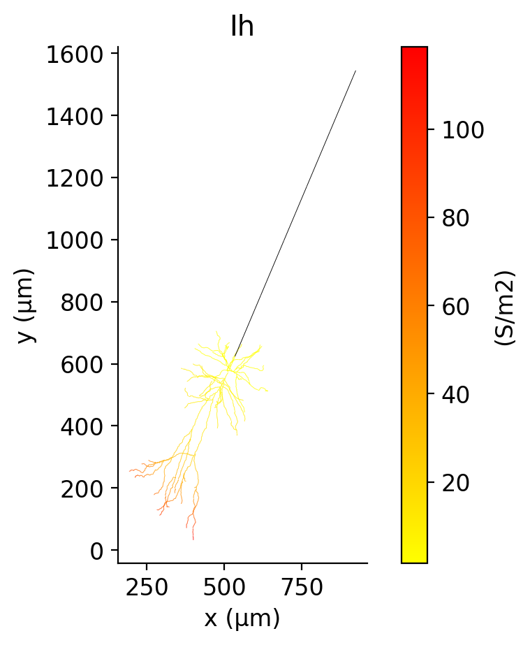
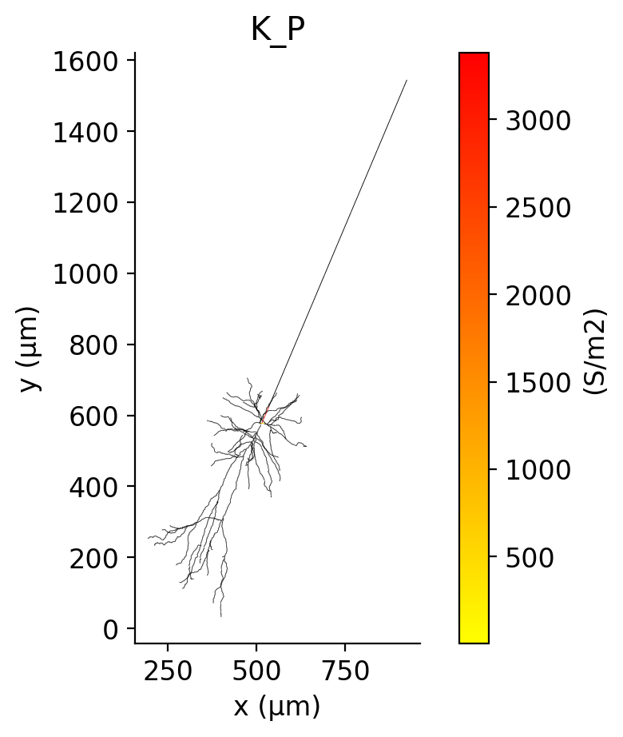
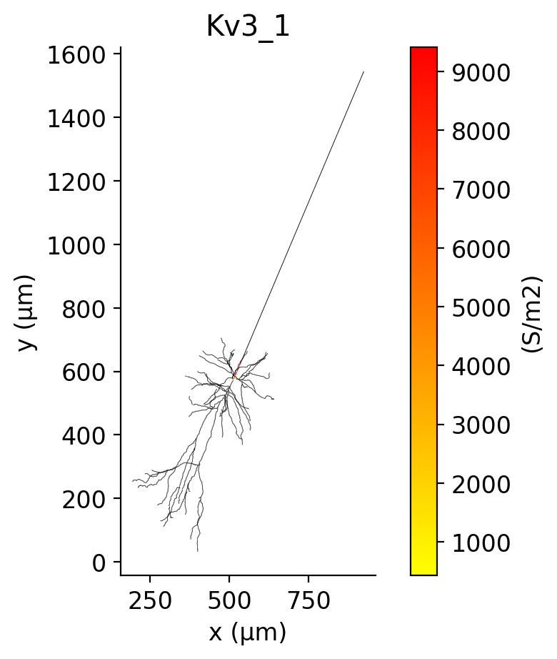
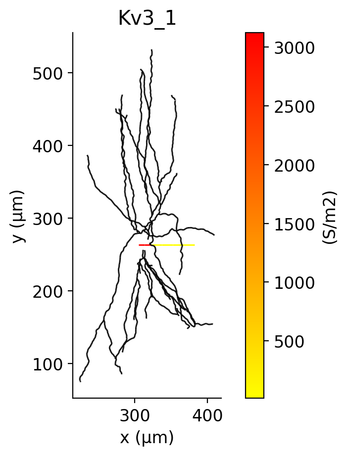

# Ion channel: summary

| Ion channel | HL23PV | HL23PYR | HL23SST | HL23VIP |
| --- | --- | --- | --- | --- |
| Ca_HVA |  |  |  |  |
| Ca_HVA (dist) |  |  |  |  |
| Ca_LVA |  |  |  |  |
| Ca_LVA (dist) |  |  |  |  |
| Ih |  |  |  |  |
| Ih (dist) |  |  |  |  |
| Im |  |  |  |  |
| Im (dist) |  |  |  |  |
| K_P |  |  |  |  |
| K_P (dist) |  |  |  |  |
| K_T |  |  |  |  |
| K_T (dist) |  |  |  |  |
| Kv3_1 |  |  |  |  |
| Kv3_1 (dist) |  |  |  |  |
| NaTg_PV |  | | | |
| NaTg_PV (dist) |  | | | |
| NaTg_PYR_axonal | |  | | |
| NaTg_PYR_axonal (dist) | |  | | |
| NaTg_PYR_somatic | |  | | |
| NaTg_PYR_somatic (dist) | |  | | |
| NaTg_SST_axonal | | |  | |
| NaTg_SST_axonal (dist) | | |  | |
| NaTg_SST_somatic | | |  | |
| NaTg_SST_somatic (dist) | | |  | |
| NaTg_VIP_axonal | | | |  |
| NaTg_VIP_axonal (dist) | | | |  |
| NaTg_VIP_somatic | | | |  |
| NaTg_VIP_somatic (dist) | | | |  |
| Nap |  |  |  |  |
| Nap (dist) |  |  |  |  |
| SK |  |  |  |  |
| SK (dist) |  |  |  |  |
| pas |  |  |  |  |
| pas (dist) |  |  |  |  |
